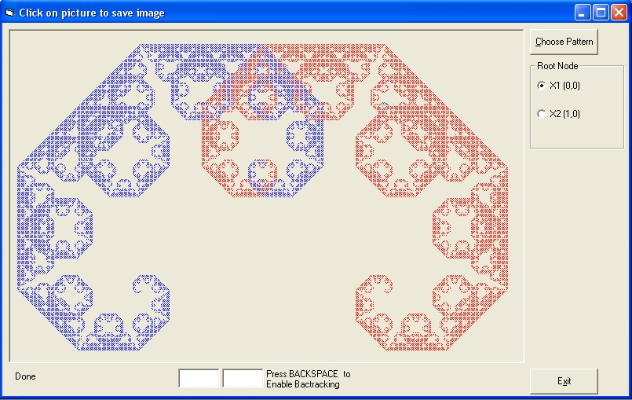



## Fractal Dust

### Description

This is lesson 4 in my fractal quest. This one is intended to explain some concepts related with fractals like recursion, backtracking and other. Code is heavily commented, I have uploaded also 3 simpler examples along these code (Fibonacci) and I also wrote a large tutorial that will explain the background of my source code. First, you shoud read a pdf tutorial, second view simpler examples until you fully understand them and then at last - Dust Fractal source code. The Code itself can generate 8 different graphics.

So, I know this lesson is not very easy to understand but try to have fun with it, I really tried to make it as simple as I can.
 
### More Info
 

             |
---                |---
**Submitted On**   |2011-07-04 04:10:02
**By**             |[Dolac](https://github.com/Planet-Source-Code/PSCIndex/blob/master/ByAuthor/dolac.md)
**Level**          |Intermediate
**User Rating**    |5.0 (10 globes from 2 users)
**Compatibility**  |VB 5\.0, VB 6\.0
**Category**       |[Graphics](https://github.com/Planet-Source-Code/PSCIndex/blob/master/ByCategory/graphics__1-46.md)
**World**          |[Visual Basic](https://github.com/Planet-Source-Code/PSCIndex/blob/master/ByWorld/visual-basic.md)
**Archive File**   |[Fractal\_Du220755742011\.zip](https://github.com/Planet-Source-Code/dolac-fractal-dust__1-73997/archive/master.zip)

